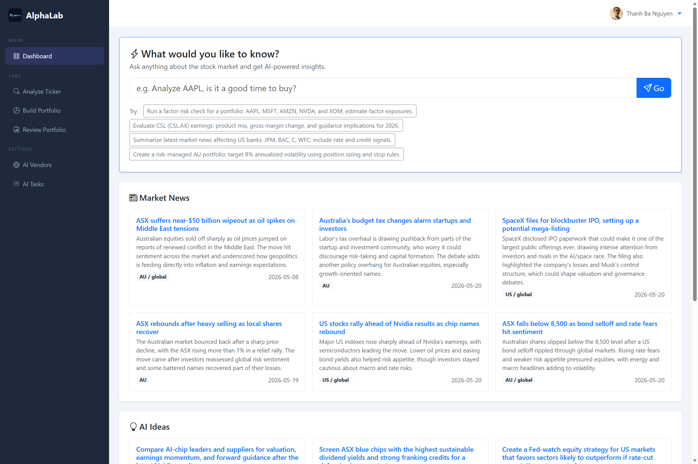

[](https://opensource.org/licenses/MIT)
[](https://github.com/Bits4Bites/alphalab/actions)
[](RELEASE-NOTES.md)

AlphaLab helps investors turn current market information into focused research, clearer decisions, and actionable
investment insights.

## ✨Features

- **Dashboard (Freestyle Mode)** Explore market questions in natural language, follow important news, and uncover
  timely research ideas.

**Market Research**
- **Market Outlook** Understand near-term market direction, major macro themes, upcoming catalysts, and risks across
  one or more regions.
- **Sector Rotation Radar** Spot shifts in market leadership and identify sectors gaining or losing momentum across
  multiple investment horizons.
- **IPO Scanner** Discover upcoming offerings and review their key dates, terms, conditions, and official sources
  before deciding which opportunities deserve deeper analysis.

**Stock Analysis**
- **Analyze Ticker** Build an evidence-based investment view for a stock or ETF using fundamentals, technical
  signals, macro context, sentiment, and scenario analysis.
- **Compare Investments** Evaluate two to five stocks or ETFs with a consistent scorecard, sourced evidence,
  profile-suitability views, scenario sensitivity, and a transparent overall ranking.
- **IPO / Listing Event** Evaluate an upcoming or recent listing through valuation, market demand, catalysts, risks,
  and optional prospectus insights.
- **Dividend Event** Assess the income opportunity, sustainability, timing, risks, and tax considerations around a
  dividend event.

**Portfolio**
- **Build Portfolio** Turn investment goals, risk tolerance, time horizon, and preferred themes into a practical
  portfolio allocation.
- **Portfolio Action Briefing** Turn current holdings, available cash, and optional watchlist names into a sourced,
  prioritized action plan. Choose a horizon from today through the next three months, review portfolio risks and
  catalysts, and export the resulting action list to CSV. Rankings combine urgency, potential impact, portfolio
  exposure, and evidence confidence; suggested quantities and values use validated delayed market snapshots.
- **Review Portfolio** Identify portfolio strengths, concentration risks, weak positions, and opportunities to
  improve diversification and resilience, with an optional market-specific plan showing estimated trades, cash impact,
  and before-and-after allocations. Saved inputs can be handed directly to Portfolio Action Briefing in the same
  browser.

**Signals**
- **Watchlist Monitor** Prioritize the names that deserve attention by combining news, technical signals, valuation,
  and risk/reward.
- **Earnings Catalyst Tracker** Prepare for upcoming earnings and market-moving events by understanding surprise
  potential, key expectations, and what to watch.

### Screenshots



## 🚀 Getting Started

### Run from Docker Image

The pre-built Docker image is available at [btnguyen2k/alphalab](https://hub.docker.com/r/btnguyen2k/alphalab):

```bash
docker run -p 8000:8000 \
  --env-file app_settings.env \
  --env-file sec_settings.env \
  --env-file external_identity_providers.env \
  --env-file ai_vendors.env \
  --env-file ai_tasks.env \
  --env-file datastore.env \
  btnguyen2k/alphalab:release
```

The app will be available at `http://localhost:8000`. 

See [Environment Variables](#environment-variables) for configuration details.

### Run from Source

**Prerequisites:** Python 3.12+

```bash
git clone https://github.com/Bits4Bites/alphalab.git
cd alphalab
python -m venv .venv

# Activate virtual environment
# Windows:
.venv\Scripts\activate
# Linux/macOS:
source .venv/bin/activate

pip install -r requirements.txt
pip install -r requirements-dev.txt  # for development

# Start the server
python server.py
```

The app starts at `http://localhost:8000` by default.

**Server environment variables:**

| Variable        | Default                     | Description                 |
|-----------------|-----------------------------|-----------------------------|
| `LISTEN_HOST`   | `127.0.0.1`                 | Bind address                |
| `LISTEN_PORT`   | `8000`                      | Port                        |
| `ENABLE_RELOAD` | `true` (Windows)            | Auto-reload on code changes |
| `NUM_WORKERS`   | `1` (Windows) / `2` (Linux) | Uvicorn workers             |

### Environment Variables

Pre-set configurations are loaded from `.env` files. All pre-set values can be overridden with environment variables.

| File                              | Purpose                                         |
|-----------------------------------|-------------------------------------------------|
| `app_settings.env`                | App name, debug mode, base URL, primary markets |
| `sec_settings.env`                | Secret key, JWT settings, allowed emails        |
| `external_identity_providers.env` | OAuth client IDs/secrets (GitHub, LinkedIn)     |
| `ai_vendors.env`                  | AI vendor endpoints, API keys, models           |
| `ai_tasks.env`                    | AI task-to-vendor/tier/model mapping            |
| `datastore.env`                   | Redis connection and key prefix                 |

**Required configurations:**

| Variable                                              | Description                                               |
|-------------------------------------------------------|-----------------------------------------------------------|
| `AL_ALLOWED_EMAILS`                                   | Comma-separated list of email addresses allowed to log in |
| `AL_GITHUB_CLIENT_ID` / `AL_GITHUB_CLIENT_SECRET`     | GitHub OAuth credentials                                  |
| `AL_LINKEDIN_CLIENT_ID` / `AL_LINKEDIN_CLIENT_SECRET` | LinkedIn OAuth credentials                                |
| `AL_LLM__<VENDOR>__<TIER>__ENDPOINT`                  | AI vendor endpoint                                        |
| `AL_LLM__<VENDOR>__<TIER>__API_KEY`                   | AI vendor API key                                         |

> At least one identity provider (GitHub or LinkedIn) and one AI vendor must be configured for the app to function properly.

**Supported AI vendors:**

| Vendor        | `<VENDOR>` value | Notes                                         |
|---------------|------------------|-----------------------------------------------|
| Google Gemini | `GEMINI`         | Uses Google GenAI SDK                         |
| OpenAI        | `OPENAI`         | Native OpenAI API                             |
| Azure OpenAI  | `AZURE_OPENAI`   | Use OpenAI API, support Azure AD credentials  |
| OpenRouter    | `OPENROUTER`     | OpenAI-compatible, supports web search plugin |

**Pricing tiers (`<TIER>`):** `FREE`, `LOWCOST`, `PREMIUM` (or any custom tier name)

> **Uploaded-document model recommendation:** Configure tasks that analyze uploaded files, currently
> `IPO_ANALYZER_ANALYZE`, with a model that supports at least 250k input tokens. Converted PDF content can be
> very long, and models with smaller context windows may reject or truncate the analysis request.
>
> **Portfolio Action Briefing model recommendation:** Configure `PORTFOLIO_ACTION_BRIEFING_ANALYZE` with a model that
> supports web search and structured JSON output. The lower-cost `PORTFOLIO_ACTION_BRIEFING_BUILD_PROMPT` task only
> writes the self-contained research prompt.

### Data storage

AlphaLab does not persist portfolio or watchlist data in an application database. Feature inputs and the latest
successful result are stored in user-scoped browser storage for convenience. Portfolio Action Briefing submits the
current request for on-demand processing, returns a streamed response, and retains no server-side portfolio record.
Redis, when configured, is used only for temporary application data and bounded analysis caches.

**Optional configurations:**

| Variable                           | Default                    | Description                                                  |
|------------------------------------|----------------------------|--------------------------------------------------------------|
| `AL_DEBUG`                         | `false`                    | Enable debug mode                                            |
| `AL_BASE_URL`                      | `http://localhost:8000`    | Base URL for OAuth callbacks                                 |
| `AL_PRIMARY_MARKETS`               | _(empty)_                  | Comma-separated list of primary markets (e.g. `US,ASX,LSE`)  |
| `AL_SECRET_KEY`                    | `change-me-in-production`  | JWT signing secret                                           |
| `AL_JWT_ALGORITHM`                 | `HS256`                    | JWT algorithm                                                |
| `AL_JWT_EXPIRE_MINUTES`            | `10080` (7 days)           | JWT token expiry                                             |
| `AL_LLM__<VENDOR>__<TIER>__MODELS` | _(empty)_                  | Comma-separated list of available models                     |
| `AL_TASK__<TASK>__VENDOR`          | _(empty)_                  | AI vendor for a specific task                                |
| `AL_TASK__<TASK>__TIER`            | _(empty)_                  | AI tier for a specific task                                  |
| `AL_TASK__<TASK>__MODEL`           | _(empty)_                  | Model for a specific task                                    |
| `AL_TASK__<TASK>__WEB_SEARCH`      | `false`                    | Enable provider-supported web search for a specific task     |
| `AL_TASK__<TASK>__REASONING_LEVEL` | _(model default)_          | Reasoning level: `low`, `medium`, or `high`                  |
| `AL_DATASTORE_REDIS_URL`           | `redis://localhost:6379/0` | Optional Redis connection for temporary application data     |
| `AL_DATASTORE_REDIS_KEY_PREFIX`    | `al:`                      | Key namespace prefix for all Redis keys                      |

**Examples:**

```env
# sec_settings.env
AL_SECRET_KEY=your-secret-key
AL_ALLOWED_EMAILS=user1@example.com,user2@example.com

# external_identity_providers.env
AL_GITHUB_CLIENT_ID=your-github-client-id
AL_GITHUB_CLIENT_SECRET=your-github-client-secret

# ai_vendors.env (nested with __)
AL_LLM__OPENAI__PREMIUM__ENDPOINT=https://api.openai.com/v1
AL_LLM__OPENAI__PREMIUM__API_KEY=sk-...
AL_LLM__OPENAI__PREMIUM__MODELS=gpt-4o,gpt-4o-mini

# ai_tasks.env (nested with __)
AL_TASK__DASHBOARD_BUILD_PROMPT__VENDOR=AzureOpenAI
AL_TASK__DASHBOARD_BUILD_PROMPT__TIER=LowCost
AL_TASK__DASHBOARD_BUILD_PROMPT__MODEL=gpt-5.6-luna
AL_TASK__DASHBOARD_BUILD_PROMPT__REASONING_LEVEL=low
```

## 🤝 Contributing

We welcome contributions from the community! Here's how you can help:

### Reporting Issues

If you find a bug or have a suggestion:

1. **Search existing issues** to avoid duplicates
2. **Create a new issue** on GitHub:
   - Go to: https://github.com/Bits4Bites/alphalab/issues/new
   - Provide a clear title and description
   - Include steps to reproduce (for bugs)
   - Add relevant labels (bug, enhancement, question, etc.)

### Submitting Pull Requests

1. **Fork the repository** to your GitHub account

2. **Clone your fork** locally:
   ```bash
   git clone https://github.com/YOUR_USERNAME/alphalab.git
   cd alphalab
   ```

3. **Create a new branch** for your feature or fix:
   ```bash
   git checkout -b feature/your-feature-name
   # or
   git checkout -b fix/your-bug-fix
   ```

4. **Make your changes** following the project's coding standards

5. **Test your changes** thoroughly:
   ```bash
   # Run tests
   pytest
   
   # Run linters
   ruff check .
   ruff format --diff .
   ```

6. **Commit your changes** with clear, descriptive messages:
   ```bash
   git add .
   git commit -m "Add: brief description of your changes"
   ```

7. **Push to your fork**:
   ```bash
   git push origin feature/your-feature-name
   ```

8. **Create a Pull Request**:
   - Go to the original repository
   - Click "New Pull Request"
   - Select your fork and branch
   - Provide a clear title and description
   - Reference any related issues (e.g., "Fixes #123")

### Code Contribution Guidelines

- Follow [PEP 8](https://peps.python.org/pep-0008/) style guide for Python code
- Write clear, self-documenting code with appropriate comments
- Add unit tests for new features
- Update documentation as needed
- Ensure all tests pass before submitting PR
- Keep pull requests focused on a single feature or fix

## 📄 License

This project is licensed under the MIT License - see the [LICENSE.md](LICENSE.md) file for details.

## 🙏 Acknowledgments

- Thanks to all contributors who help improve this project
- Built with ❤️ by the community

## 📞 Contact & Support

- **Issues**: [GitHub Issues](https://github.com/Bits4Bites/alphalab/issues)
